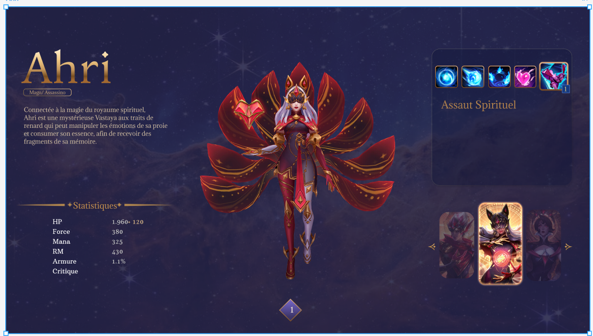

## Raphaël Verchain

# League of Legends Web Application

## 📖 Introduction
Ce projet est une application web permettant de découvrir les personnages de League of Legends et leurs détails, tels que leurs statistiques, sorts, skins, et plus encore. L'utilisateur pourra interagir avec les données en choisissant un personnage et en ajustant son niveau pour voir les stats et dégâts dynamiques.

## ⚙️ Technologies utilisées

### Backend
- **Framework** : Sails.js
- **Base de données** : MySQL
- **Langage** : JavaScript (Node.js)

### Frontend
- **Framework** : Vue.js
- **Langage** : JavaScript, HTML, CSS

### Infrastructure
- **Outils** : Docker, Docker Compose

### Conteneurs :
- **Backend** : Sails.js
- **Base de données** : MySQL
- **Frontend** : Vue.js

## 📋 Tâches réalisées

### 1. Mise en place de la structure du projet
- **Dockerfile** pour l'environnement de développement.
- **Vue.js** pour la partie front-end.
- **API Sails** pour la partie back-end.
- **Docker Compose** pour gérer les services (API, base de données, etc.).
- **PhpMyAdmin** pour la gestion de la base de données MySQL.
- **MySQL** comme base de données.

### 2. Conception de la base de données
- La structure de la base de données a été définie. La mise en place réelle sera effectuée lors des prochaines étapes.

#### Schéma de la base de données

### 3. Maquette du site web
- Début de la création de la maquette du site web sur **Figma**.

#### Maquette du site web

## 📝 À venir

- Finaliser la création de la base de données.
- Continuer à développer la maquette du site et la fonctionnalité de l'application.

