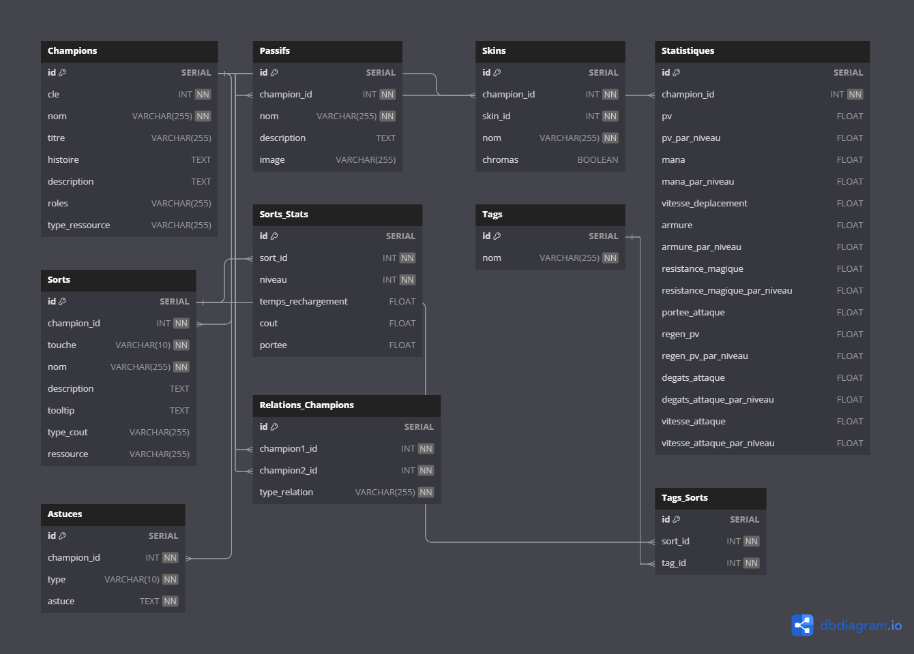

## Raphaël Verchain

# League of Legends Web Application

## 📖 Introduction
Ce projet est une application web permettant de découvrir les personnages de League of Legends et leurs détails, tels que leurs statistiques, sorts, skins, et plus encore. L'utilisateur pourra interagir avec les données en choisissant un personnage et en ajustant son niveau pour voir les stats et dégâts dynamiques.

## ⚙️ Technologies utilisées

### Backend
- **Framework** : Sails.js
- **Base de données** : MySQL
- **Langage** : JavaScript (Node.js)

### Frontend
- **Framework** : Vue.js
- **Langage** : JavaScript, HTML, CSS

### Infrastructure
- **Outils** : Docker, Docker Compose

### Conteneurs :
- **Backend** : Sails.js
- **Base de données** : MySQL
- **Frontend** : Vue.js

## 📋 Tâches réalisées

### 1. Mise en place de la structure du projet
- **Dockerfile** pour l'environnement de développement.
- **Vue.js** pour la partie front-end.
- **API Sails** pour la partie back-end.
- **Docker Compose** pour gérer les services (API, base de données, etc.).
- **PhpMyAdmin** pour la gestion de la base de données MySQL.
- **MySQL** comme base de données.

### 2. Conception de la base de données
- La structure de la base de données a été définie et mise en place. Cette base de données permet de stocker les informations des champions de *League of Legends*, telles que les statistiques, les sorts, les skins, et plus encore.

#### Schéma de la base de données

### 3. Récupération des données via l'API Riot
- Récupération des informations des champions (nom, titre, histoire, etc.) depuis l'API de Riot Games.
- Pour chaque champion, récupération des données détaillées (passifs, skins, statistiques, sorts, etc.).
- Insertion des données dans la base de données MySQL pour chaque champion, incluant :
  - Description du champion.
  - Passifs et sorts associés avec leurs statistiques.
  - Skins, y compris l'image du skin par défaut et les autres skins disponibles.
  - Statistiques du champion (points de vie, mana, armure, etc.).

### 4. Maquette du site web
- Début de la création de la maquette du site web sur **Figma**.

#### Maquette du site web

## 📝 À venir

- Finaliser la création de la base de données avec toutes les données supplémentaires comme les astuces et les relations entre champions.
- Ajouter la fonctionnalité pour interagir avec les données via l'interface utilisateur (choix du champion, ajustement des niveaux, etc.).
- Continuer à développer la maquette du site et la fonctionnalité de l'application.
- Implémenter la gestion dynamique des tags et de leur association avec les sorts.

---

## **Changements récents dans le projet**

### **Mise en place des modèles pour l'API LeagueDB**
Une nouvelle fonctionnalité a été ajoutée pour structurer les modèles nécessaires à la gestion des champions, de leurs skins, sorts, passifs, statistiques et relations. Cela inclut également la configuration de la base de données MySQL et des migrations initiales.

---

## **Problèmes connus / Points à améliorer**
- **Astuces** : Les astuces des champions ne sont pas récupérées pour l'instant. Il faudra les ajouter dans une prochaine étape.
- **Tags et Tag_Sorts** : La gestion des tags et leur association avec les sorts n'a pas encore été implémentée. Cela nécessitera de récupérer et associer les tags automatiquement.
- **Implémentation des contrôleurs et routes** : Actuellement, seuls les modèles sont en place. Les contrôleurs et routes doivent encore être développés pour permettre l’interaction avec les données.

---

### **Captures d'écran / Résultats attendus**

N/A (Aucune interface utilisateur n'est modifiée pour le moment, il s'agit d'un travail côté backend et base de données).

---

## **Commentaires supplémentaires**

Cette mise à jour de l'application ajoute un backend robuste capable de structurer et stocker les données essentielles des champions de *League of Legends* dans une base de données relationnelle. Les prochaines étapes incluent l'ajout des **routes et contrôleurs**, ainsi que l'intégration de tests unitaires pour assurer la stabilité du backend.

---
